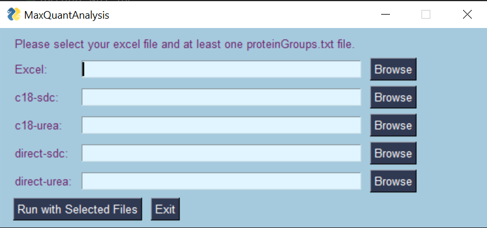

# MaxQuantAnalysis

MaxQuantAnalysis is a tool that provides a platform for downstream analysis after execution of the MaxQuant program.

## Installation and Setup

First, download [MaxQuantAnalysis](https://github.com/JoshLoecker/MaxQuantAnalysis) and ensure you have [Python 3.3](https://www.python.org/downloads/) or higher installed.

After that, create a new Python virtual environment using the venv module.
The 'env' argument is the location where the virtual environment will be installed; you can place this in the same folder as MaxQuantAnalysis.
```
For Unix/Mac systems:
python3 -m venv env

For Windows:
py -m venv env
```

Next, you will need to activate the virtual environment by running the 'activate' file in the virtual environment folder you created in the last step.
```
For Unix/Mac systems:
source env/bin/activate

For Windows:
.\env\Scripts\activate
```

Then, install the requirements for this project using pip.
```
For Unix/Mac systems:
pip install -r requirements.txt

For Windows:
py -m pip install -r requirements.txt
```

## Running the Program - Command Line

This program uses command line arguments to determine what kind of input is being used and where the excel file to print to is saved.
Available arguments include:
```
--direct, -d
--c18, -c
--sdc, -s
--urea, -u
--input, -i
--excel, -x
```

The -c/--c18 flag is not valid with the -d/--direct flag, as these are two methods of Mass Spectrometry analysis and it is not reasonable for them to be used together.

The -s/--sdc flag is not valid with the -u/--urea flag, as these are two types of experiments that should not be used together.

You should not have to worry about errors with invalid pairing of flags. If invalid flags are seen, the program will safely exit.

After the input flag, enter the location of a file named "proteinGroups.txt".

After the excel flag, enter the location of the excel file (if it does not yet exist, it will be created).

Examples (where 'main.py' is the location of your main.py file):
```
For Unix/Mac systems:
python3 main.py --direct --urea --input ./data/direct/urea/proteinGroups.txt --excel ./data/experiment_results.xlsx
For Windows systems:
python main.py --c18 --sdc --input ./data/c18/sdc/proteinGroups.txt --excel ./data/experiment_results.xlsx
```
# Running the Program - GUI
Instead of giving arguments/filenames through the command line,
you can run the program through a basic GUI.

You will still need to open your command line to launch the program.
First, change your directory to the location you downloaded MaxQuantAnalysis.
Example:
```
cd C:\Users\YourName\Downloads\MaxQuantAnalysis
```

Then launch the program with this command:
```
For Unix/Mac systems:
python3 GUI.py
For Windows systems:
python GUI.py
```
You should see this window open.


Click browse for each file you'd like to use.
Match the type of file you select with the type indicated to the left of the browse button.

You can run the program with a minimum of two files: one Excel file and one proteinGroups.txt file.
Click the "Run with Selected Files" button at the bottom to run the program.